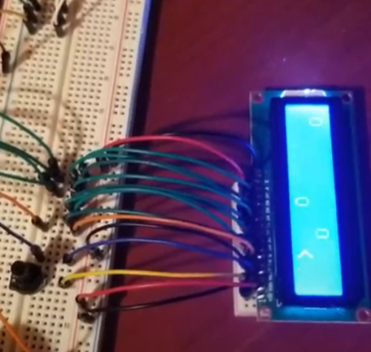
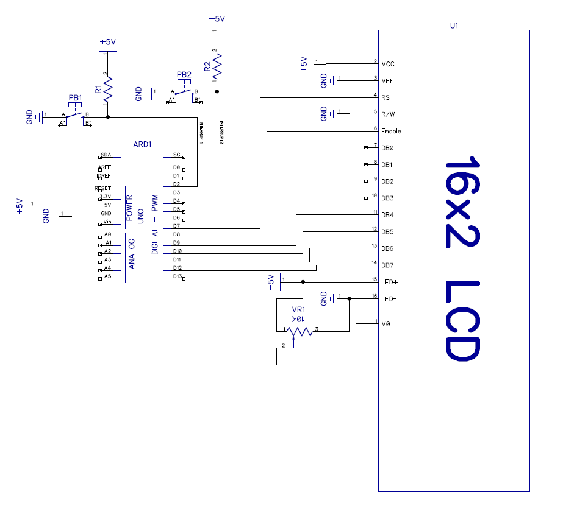

# LCD Race

This was a quick one-nighter embedded project I built for fun. You control a racing car using push-buttons to avoid randomly generated obstacles.

I used an Arduino Uno, two push-buttons for controls, and a 16x2 LCD display.

## Schematic
